## Hi there, I'm Gaurav 👋

Software Engineer on the Database Engine team at **Stripe**. Previously at Rippling, VMware, and Lavelle Networks.

Over 10+ years I've worked as IC, tech lead, and engineering manager — building software-defined networking for 10s of thousands of edge routers, Kubernetes platforms for developers, and scaling one of the largest database clusters in the world.

I write about performance engineering, scalable infrastructure, and software on my blog at **[gauravsarma.com](https://gauravsarma.com)**.

---

<!-- TOP_REPOS_START -->
### 🚀 Most Active Repos (Last Year)

- [crashdsa](https://github.com/gsarmaonline/crashdsa) — 135 commits, +23,638 / -2,689
- [cronny](https://github.com/gsarmaonline/cronny) — 123 commits, +24,996 / -784
- [localisprod-v2](https://github.com/gsarmaonline/localisprod-v2) — 104 commits, +13,784 / -1,485
- [goiter](https://github.com/gsarmaonline/goiter) — 51 commits, +5,819 / -2,386
- [infrastructure](https://github.com/gsarmaonline/infrastructure) — 35 commits, +1,924 / -1,068
- [gobot](https://github.com/gsarmaonline/gobot) — 30 commits, +16,444 / -7,081
- [tusker](https://github.com/gsarmaonline/tusker) — 30 commits, +11,491 / -253
- [nvim](https://github.com/gsarmaonline/nvim) — 29 commits, +4,182 / -160
- [technify-motions](https://github.com/gsarmaonline/technify-motions) — 15 commits, +10,281 / -827
- [faas](https://github.com/gsarmaonline/faas) — 8 commits, +3,924 / -92

<!-- TOP_REPOS_END -->

---

### 📊 Stats

---

### 🛠 Things I work with

---

### ✍️ Recent posts

- [Building an autonomous software engineering agent (Gigaboy)](https://gauravsarma.com)
- [AI Tennis Coach using MediaPipe and Claude](https://gauravsarma.com)
- [Elasticsearch optimization — Lucene segments & partial results](https://gauravsarma.com)

---

### 🔗 Connect

